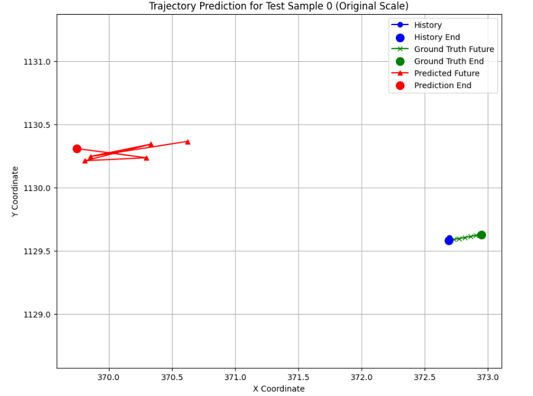
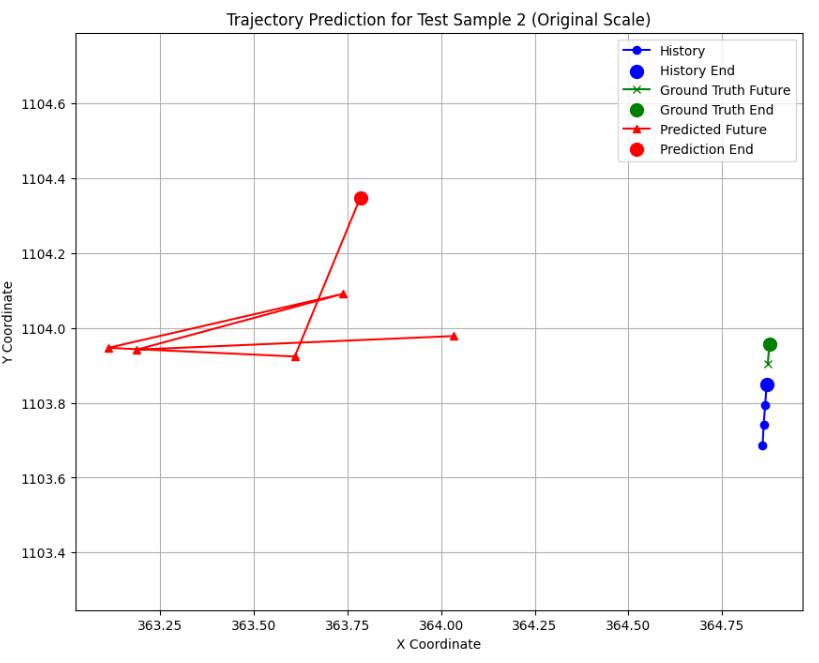
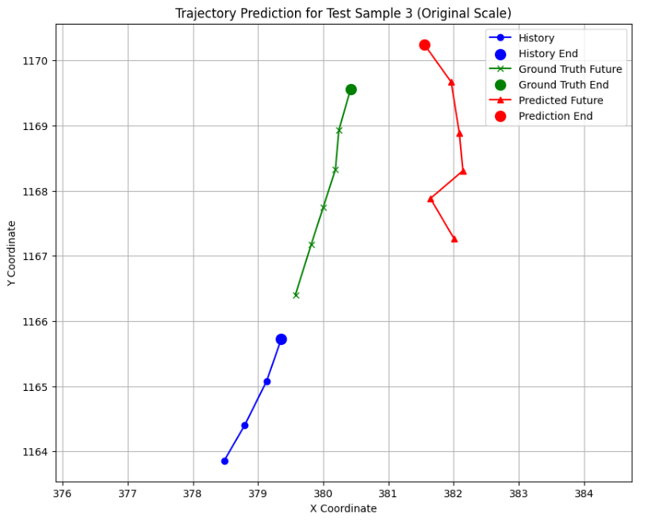

**🚗 Trajectory Prediction for Pedestrians and Cyclists**

**📌 Project Overview**

This project focuses on predicting the future trajectories of pedestrians and cyclists using past movement data from the nuScenes v1.0-mini dataset.

The system takes historical position data and predicts future coordinates over a short time horizon, improving safety and decision-making in autonomous driving systems.

**🧠 Model Architecture**

The model is designed using a deep learning architecture with LSTM layers and a Mixture Density Network (MDN) output, as implemented in the project.

🔄 Architecture Details:
- Input: Sequence of past trajectory features
- (x, y, vx, vy, speed, social features)
- LSTM Layer 1: 128 units (return_sequences=True)
- LSTM Layer 2: 128 units
- Dense Layer: 64 units (ReLU activation)
- Output Layer: MDN output (multiple trajectory predictions)
  
⚙️ Key Components:
- LSTM: Captures temporal dependencies
- MDN: Enables multi-modal trajectory prediction
- 
🔧 Training Configuration:
- Loss Function: Custom MDN Loss (Negative Log Likelihood)
- Optimizer: Adam (learning rate = 0.001)
- Epochs: 200
- Batch Size: 32
  
**📊 Dataset Used**

The project uses the nuScenes v1.0-mini dataset.
📌 Dataset Details:
- Real-world autonomous driving dataset
- Includes pedestrians and cyclists
- Time-series trajectory data
- 
🔧 Data Processing:
- Extracted trajectories
- Generated input-output sequences
- Total sequences: 1308
  
**⚙️ Setup & Installation Instructions**

1. Clone the Repository
  git clone https://github.com/sanjanapstech-ui/AI-in-mobility.git
  cd AI-IN-MOBILITY

2. Create Virtual Environment (Optional)
  python -m venv venv
  source venv/bin/activate      # Linux/Mac
  venv\Scripts\activate         # Windows

3. Install Dependencies
  pip install -r requirements.txt

4. Dataset Setup
- Download nuScenes v1.0-mini dataset
- Place it in your project directory
- Update dataset path if needed
  
**▶️ How to Run the Code**
🔹 Run on Google Colab (Recommended)

👉 

🔹 Run Locally
  jupyter notebook

Then:
- pen the notebook
- Run all cells step-by-step

📈 Example Outputs / Results

**📊 Performance:**
- Test Loss (NLL): -5.9324
- Average Displacement Error (ADE): 3.2123
- Final Displacement Error (FDE): 3.0146
  
📌 Output Visualization:

The model generates trajectory plots showing:

- Past trajectory
- Ground truth future
- Predicted future trajectory
  

These results show that the model successfully captures motion patterns and predicts realistic paths.

